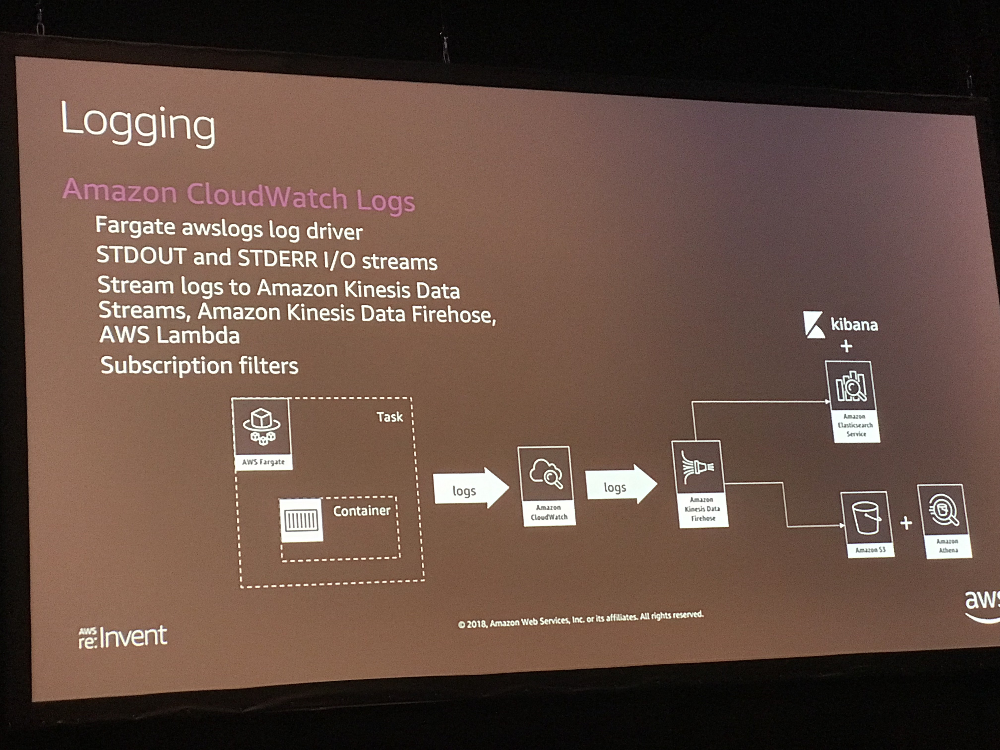
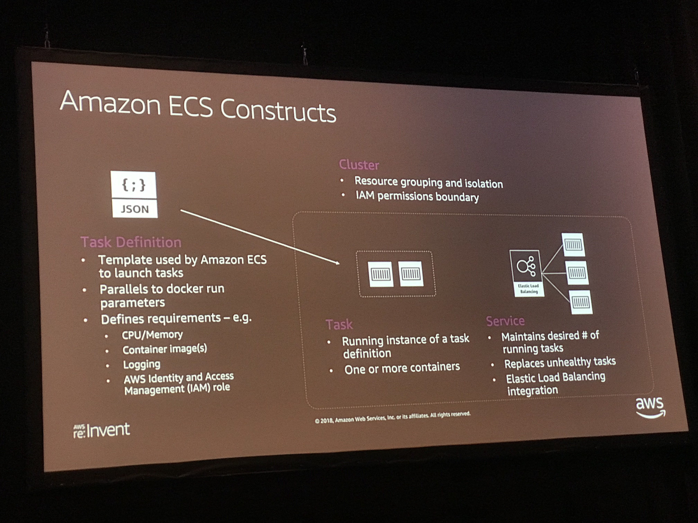
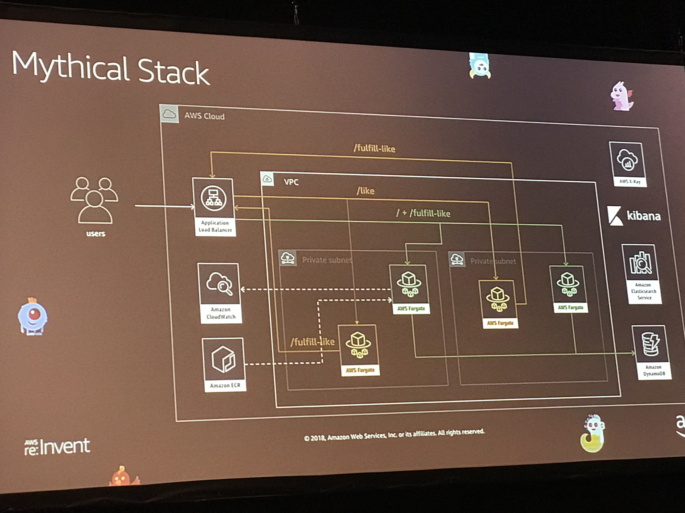

# Monitor

## Serverless Monitoring on AWS

### Goals
- Understand the basic concepts and the best practices of monitoring on AWS
- Design customer monitoring frameworks based on AWS services

Requirements for a cloud monitoring solution 
- Improve security and compliance
- Reduce TCO (total cost)
- Scalable and auditable - react to on demand
- Easily automate repetitive tasks
- Manage cloud-native architecture 
- Cross-platform (Windows/Linux)

To meet requirements, solution should be
- Reusable (resource to resource, env to env, business unit 2 business unit)
- Serverless (more reliable, lower cost, less management)
- Scalable 
- Low cost

Why Monitor?
- Ensure good user experience
- Understand Application health
- Understand Execution logic
- Tune your system

How Do you Monitor?
- Metrics - CloudWatch
- Events (changes)
- Logs (with timing information)
- Traces (transactional execution flow) - AWS X-Ray
- Dependency Graph - X-Ray Service Map
- Code-level data

### Metrics
- Resource consumption (CPU, memory, network)
- Application behavior (load, response time, error rates)
- Environment stats (instance counts, API throttes, etc)

Services:
- Amazon CloudWatch
    - Create custom metrics
    - Work with logs
    - Alerts can be defined on CloudWatch metrics

- AWS X-Ray
    - Enables e2e transaction tracing

### Alerts
- High response time
- High error rate
- Unhealthy infrastructure

Setting up alarms
- Choose a Metric 
- Define the Threshold 
- Define Notifications

Services:
- Instrumentation with AWS X-Ray
- CloudTrail + CloudWatch Rules
- AWS Config Rules
    - AWS Config -> Rules -> Non-compliant resources -> AWS Lambda -> AWS SNS

Host:
- Amazon API Gateway, AWS Lambda (nodejs), Java

Capture: 
- AWS X-Ray 
- Amazon CloudWatch
- Lambda trigger

Process:
- Amazon Kinesis Streams
- Amazon Kinesis Analytics
- Amazon Kinesis Firehose
- EMR
- Machine Learning

Store:
- S3
- Dynamo DB
- Redshift 

Action:
- Amazon SNS

## Management and Operations with AWS Fargate

### Goals
- Log Analysis with CloudWatch Logs and Elasticsearch
- Distributed Tracing and Debugging with AWS X-Ray
- Implementing Task Auto-Scaling

Scheduling and orchestration
Cluster Management, Placement Engine 

AWS Fargate take care of Availability Zones

- Amazon ECS Constructs
    - Observability
        - Monitoring
        - Logging
        - Tracing
        - Alerts
    - Monitoring
        - CloudWatch ECS Metrics 
        - ECS metadata endpoint
        - Partners: Datadog, dynatrace
    - Logging
        - CloudWatch Logging 
    - Distributed Tracing
        - X-Ray
    - Alerting
        - CloudWatch 
        - Service Integration
            - Amazon SNS
            - Amazon Lambda (event driven)

[Example Repo](https://github.com/aws-samples/aws-modern-application-workshop/tree/fargate/workshop-3)

## What we can learn from Monitor?

All things in the clould can be monitored. The key question is, how we can make them meaningful? Currently, Venn have some monitor/metrics setup, but there are still more to think and improve. To have a better monitor, we need to think again: (1) what should be our metrics? Is currect metrics good enough? (2) Do we have events/transactions tracing? (3) Can we setup SNS alerts on CloudWatch metrics? (4) How can we have better monitor/logging/event tracing/graph?

