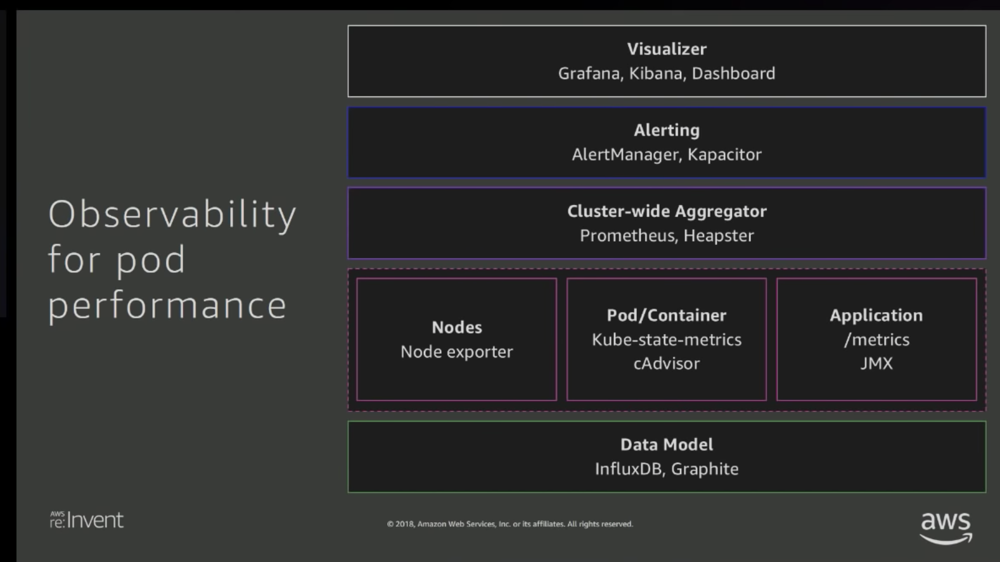

# Operation

## Running Amazon EC2 Workloads at Scale

We can use EC2 auto scale group in a cost optimized architecture:

This architecture is dynamically react to changing,  demand, optimize cost. Ideally, we want to (1) scale the service for predictable traffic patterns, (2) scale the service for dynamic traffic patterns, (3)optimize for performance, available and cost. In the workshop, we tried to deploy a auto scaling music streaming service. See the github link: [Example Repo](https://github.com/awslabs/ec2-spot-labs/tree/master/workshops/running-amazon-ec2-workloads-at-scale)

## Migrating to AWS Fargate

### The evolution of compute platform on AWS:
- EC2 -> ECS -> Fargate
- VMs in the cloud -> Containers in EC2 instances in the cloud -> Cantainers in the cloud (no servers)

It’s not just an infrastructure shift. It’s also a paradigm shift in application design. It's fundamentally changing the way in which we are thinking about building and designing out app. 

### How containers shifted the paradigm 
- Decoupled applications
    - Decoupled packaging & builds -> Docker Image format
    - Decoupled deployments -> more deployments -> CI/CD innovation 
    - Decoupled scaling -> Cluster management services like ECS, EKS, etc. 
    - Decoupled locality of applications -> Service discovery
- The Microservices Era
    - It changes the way we think of applications

### How AWS Fargate is shifting the paradigm
- Infrastructure shift: the underlying server is abstracted away
- Design paradigm shift: Decouple applications from the host

Decouple from the host
- It is a joint responsibility 
	- Fargate: Innovate new host-agnostic ways to achieve the same goals
	- Customer: Adopt these new modes of operation 

Practical examples:
- Decoupled networking: awsvpc networking mode
    - Bridge mode, host mode -> ECS/EC2 launch type
    - Awsvpc networking mode
    - Task namespace
    - Localhost 
    - Task Elastic network interface (ENI)
- Decoupled IAM permissions: Task Role
- Decoupled Monitoring 
    - side-car container model (Datadog)

### Take away
- Examine your application for tethers to host level primitives
- Investigate a host-agnostic alternative in Fargate
- If you can’t find one, come tell us. 

### Turners’ Journey to Fargate 
- Cost Savings
- Easily deployed
- Minimal understanding required

[Youtube Link](https://www.youtube.com/watch?v=rIfQT4ZGI3Y)

## Running High Performance  k8s Cluster with Amazon EKS

- Optimize your container
    - Optimize for smaller size 
        - Minimalist images available
- Optimize pods
    - try avoid sidecar
    - use resouce constraints
    - Optimize density vs size of pods
        - Garbage collection better in small pod
    - Observability for pod performance
    
- Optimizing your worker nodes

### Demo from State Street

High performance database running one EKS

- What and why
    - High Concurrency 
    - Low Latencies
    - Open Source
    - Cloud Native
    - Custom database

- Replication architecture
    - MySql master/slave
    - RocksDB Engine (FB)
    - MariaDB or Percona
    - Standard MySql features
    - Cloud Native

- Resilient scale-out architecture 
    - S3 for backups
    - Cluster hosted on Amazon EKS
    - Scale out

- Getting the most out of K8s
    - Taints & tolerations
    - Affinity & anti-affinity
    - Services
    - Resource requests and limits
    - SYSCTL
    - StatefulSet
    - Operator + ETCD
    - DaemonSet

[Youtube recap](https://www.youtube.com/watch?v=YQWt6wdAZMU)

## Management and Operations with EKS (Workshop)

- Health Checks
- Autoscaling our Applicagtions and Clusters
- CI/CD with AWS CodePipineline 
- Tracing with AWS X-Ray
- Batch Processing with Argo
- Create Network Policies using Calico
    - Network policies allow you to define rules that determine what type of traffic is allowed to flow between different services. For example, you can only allow traffic from frontend to backend in your application.
    - Network policies also help in isolating traffic within namespaces. For instance, if you have separate namespaces for development and production, you can prevent traffic flow between them by restrict pod to pod communication within the same namespace.
- Logging with Elasticsearch, Fluentd, and Kibana(EFK)
- Monitoring using Prometheus and Grafana

[Workshops Examples](http://eksworkshop.com/)

## Actions

- Add Health Checks for pods level
- Autoscaling our Applicagtions and Clusters
- Tracing with AWS X-Ray
- Use Calico for better security
- Log with Cloudwatch and kibana
- Monitor using Prometheus and Grafana
- Optimize container/pods/worker nodes
- In future, they might have Fargate for EKS

