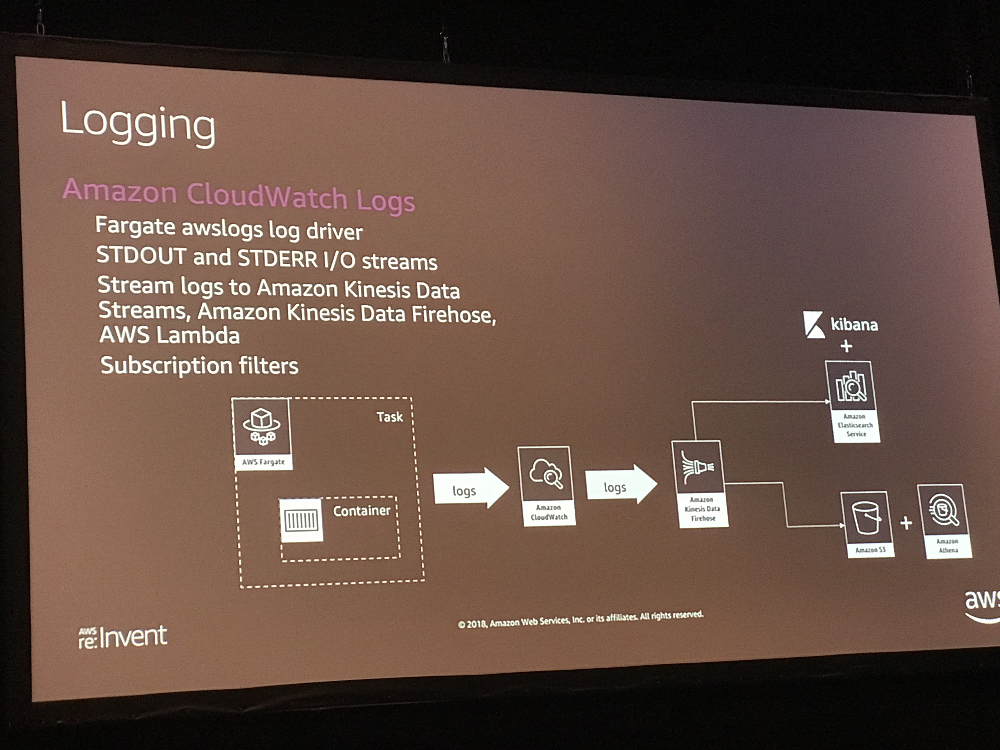
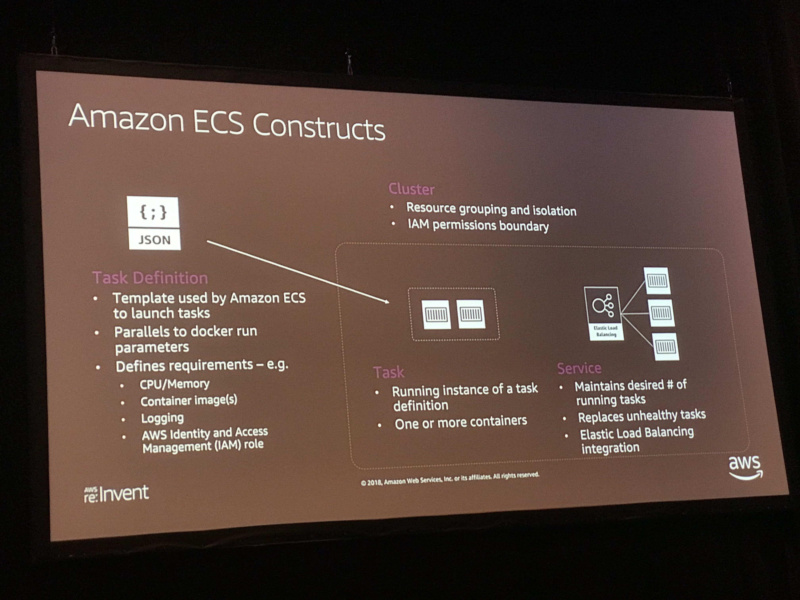
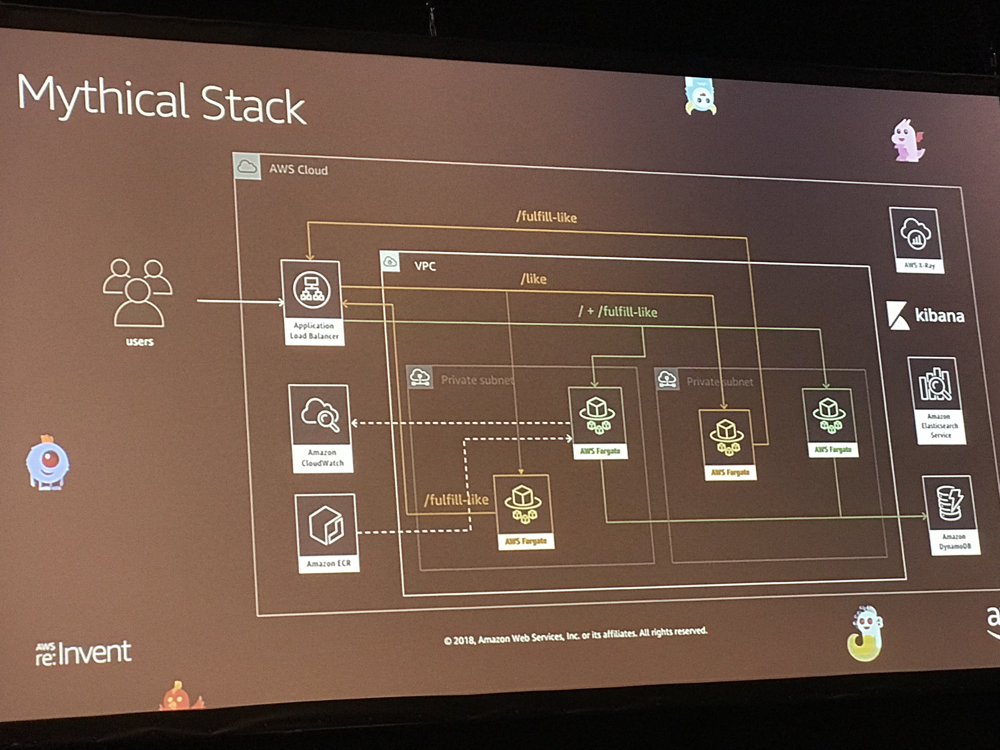

# Operation

## Management and Operations with AWS Fargate

### Goals
- Log Analysis with CloudWatch Logs and Elasticsearch
- Distributed Tracing and Debugging with AWS X-Ray
- Implementing Task Auto-Scaling

Scheduling and orchestration
Cluster Management, Placement Engine 

AWS Fargate take care of Availability Zones

- Amazon ECS Constructs
    - Observability
        - Monitoring
        - Logging
        - Tracing
        - Alerts
    - Monitoring
        - CloudWatch ECS Metrics 
        - ECS metadata endpoint
        - Partners: Datadog, dynatrace
    - Logging
        - CloudWatch Logging 
    - Distributed Tracing
        - X-Ray
    - Alerting
        - CloudWatch 
        - Service Integration
            - Amazon SNS
            - Amazon Lambda (event driven)

[Example Repo](https://github.com/aws-samples/aws-modern-application-workshop/tree/fargate/workshop-3)

## Management and Operations with EKS

- Health Checks
- Autoscaling our Applicagtions and Clusters
- CI/CD with AWS CodePipineline 
- Tracing with AWS X-Ray
- Batch Processing with Argo

[Examples](http://eksworkshop.com/)

## Running Amazon EC2 Workloads at Scale

[Eample Repo](https://github.com/awslabs/ec2-spot-labs/tree/master/workshops/running-amazon-ec2-workloads-at-scale)

## Actions

