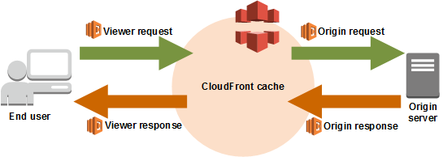
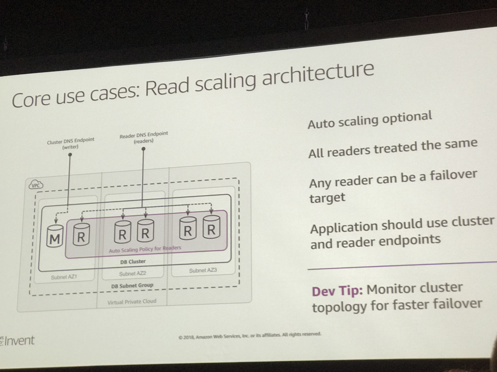
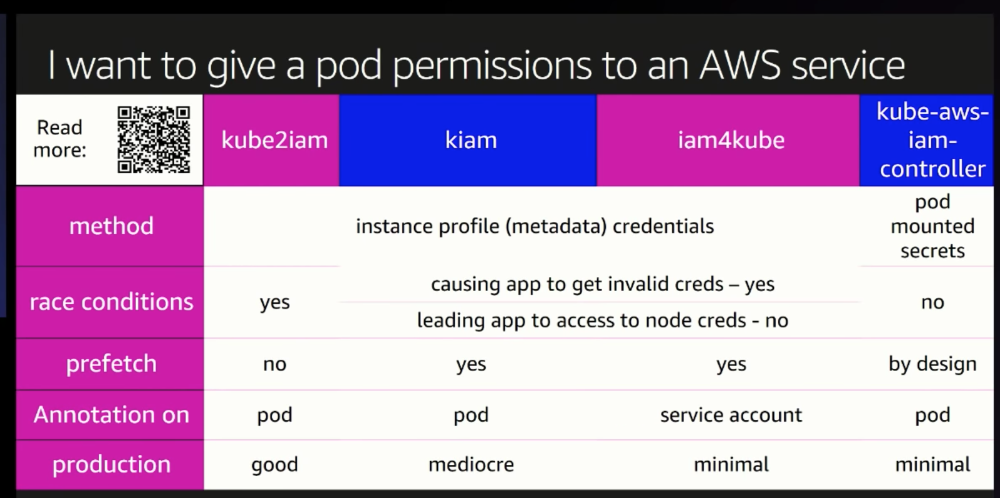

# Serverless on AWS

## Serverless web application

- Web host: [Amazon S3](https://aws.amazon.com/s3/). S3 hosts static web resources including HTML, CSS, JavaScript, and image files which are loaded in the user's browser. 
- Auth: [Amazon Cognito](https://aws.amazon.com/cognito/). Amazon Cognito provides user management and authentication functions to secure the backend API. 
- API: [AWS Lambda](https://aws.amazon.com/lambda/), [Amazon API Gateway](https://aws.amazon.com/api-gateway/). JavaScript executed in the browser sends and receives data from a public backend API built using Lambda and API Gateway.
- Database: [Amazon DynamoDB](https://aws.amazon.com/dynamodb/). DynamoDB provides a  persistence layer where data can be stored by the API's Lambda function.

[Example repo](https://github.com/aws-samples/aws-serverless-workshops/tree/master/WebApplication)

## Multi Region Failover

This session talked about why serverless. how distribute traffic (DNS), Amazon API Gateway, DynamoDB (w/Global Tables), Cloud 9, AWS Lambda,

- The application must be able to failover to another region in the case of a disaster. The RTO and RPO must both be less than 15 minutes.
- Failover: Use Route53 to automatically use health check fail information and then point your domain at your secondary region.

[Example repo](https://github.com/aws-samples/aws-serverless-workshops/tree/master/MultiRegion)

## Microservices with Docker and AWS Fargate

[Example repo](https://github.com/aws-samples/aws-modern-application-workshop/tree/fargate/workshop-1)

## Customizing Content Delivery with Lambda@Edge

Lambda@Edge is an extension of AWS Lambda, a compute service that lets you execute functions that customize the content that CloudFront delivers. When you associate a CloudFront distribution with a Lambda@Edge function, CloudFront intercepts requests and responses at CloudFront edge locations. 

The workshop demonstrates the usage of the following AWS services:
- Amazon S3: the website's static files will be stored in an S3 bucket
- Amazon DynamoDB: the dynamic data will be stored in a DynamoDB table
- Amazon CloudFront: the fast and secure content delivery will be performed by a CloudFront distribution
- AWS Lambda@Edge: the dynamic content generation and content customization will be driven by Lambda@Edge functions

[Example repo](https://github.com/aws-samples/aws-lambda-edge-workshops/blob/master/Workshop1/README.md)

## Accelerating Application with Amazon Aurora
Amazon Aurora is up to five times faster than standard MySQL databases and three times faster than standard PostgreSQL databases. It provides the security, availability, and reliability of commercial databases at 1/10th the cost. 

- Get Started
    - https://s3-eu-west-1.amazonaws.com/dat312workshop/dat312_lab_guide_v2.pdf
    - http://bit.ly/dat312-guide-text

- Architecture & deployment automation
    - Key characteristics 
        - Log-structured storage volume shared between all cluster nodes
        - Readers strictly read-only
        - Optimized for high throughput 
    - Core use cases: Separated workload architecture
        - image 
        

    - Deployment automation
        - Declarative automation (CloudFormation, Terraform)
        - Procedural automation (AWS cli tools, AWS SDKs) 
- Improving development outcomes
- Develop apps with performance in mind
    - Fast database cloning
    - Backtracking databases
    - Monitoring built in

## Mastering k8s on AWS

When things running in scale, it's complicated. For example, you might want multiple masters on multiple AZ because you want to be able to failover. On EKS cluster, every cluster has its own control pane which is made of multiple masters and multiple instances that running multiple AZs. You can only point your worker nodes to the EKS masters endpoints. 

- Networking: Pod to Pod
- Networking: Pod to Service 
    - Traffic -> proxy -> service -> pods

K8t Service Type
1. ClusterIP
Exposes the service on a cluster-internal IP
Only reachable from within the cluster
Access possible via kube-proxy
Userful for debugging.
2. NodePort
3. LoadBalancer 
Traffic -> LB -> service -> pods
Exposes the service externally using a cloud provider’s load balancer
NodePort and ClusterIP services

Service load balancer: NLB

4. ExternalName

K8t Ingress Object
ALB Ingress Controller

Security: Runtime
Give a pod permissions to an AWS service
Kube2iam
Kiam
Iam4kube
Kube-aws-iam-controller
Logging: workers
EFK - DIY
https://eksworkshop.com/logging/

At Snap transition from k8t to EKS

Snap’s Approach to Infrastructure Goals
Flexibility
Security
Availability/ Performance
Cost Reduction
Minimize operational work

Technical State of Snap 2016
1.Small number of large monolithic applications
Projects slowed due to inflexibility
Infrastructure started to be the long pole 
2.  Organizational boundaries also got in the way
Work was single threaded through central teams
New product teams were not happy with 
3.Regionalization was impossible in our old architecture
4.Performance matters a lot
Stuck with “they way things have always been done”

Service-Oriented architectures 
We had seen the value of microservices

Portability
Our strategy has always been to use the best of breed
Orchestration is half the battle 

Kubernetes
Solves a lot of the problems of managing a large set of services
Run it ourselves? Vs EKS

EKS Cluster
POD

Results
Saved money
Containers and Amazon EKS give us a lot of flexibility to adopt new tew technologies 
Performance improvement
Amazon EKS is already widely adopted at Snap’

### Keynotes
- AWS is going to have private link endpoint for EKS next year. 

[Youtube recap](https://www.youtube.com/watch?v=8OPkt93WyPA)

## Actions

Discuss with team about: 
1. How can we reduce deploy downtown? What would be the bottleneck to minimun downtown? 
2. Do we want to add multi region failover now? 
3. If we want to scale up to other region, can we do that automatically? How can we better use auto scale group
4. Use Aurora to replace PostgreSQL databases, it can clone fast and zero cost, it can backtracing fast and it has built in monitoring. 
